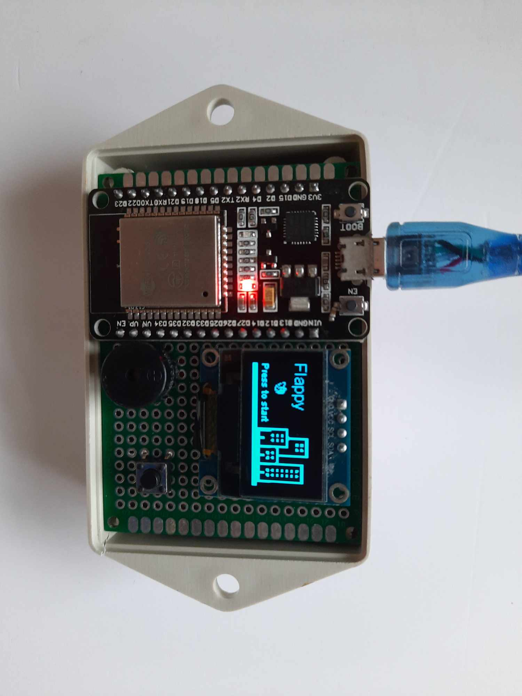

# Flappy Bird on ESP32 Arduino



## Overview

This project is an implementation of the classic Flappy Bird game on the ESP32 using the Arduino framework. The game is designed to run on a SSD1306 Oled display, providing a fun and interactive experience on the ESP32 platform.

## Features

- **Responsive Controls:** Use button to control the bird's flight.
- **OLED Display:** Enjoy the game on a OLED display.
- **Score Tracking:** Keep track of your high score, press BOOT on the ESP32 to reset high score.

## Hardware Requirements

- ESP32 Development Board.
- SSD1306 Oled display compatible with the ESP32.
- Button and buzzer.

## Dependencies

- [ThingPulse OLED SSD1306](https://github.com/ThingPulse/esp8266-oled-ssd1306.git): SSD1306 Oled display library for ESP8266 and ESP32.
- [Preferences](https://www.arduino.cc/reference/en/libraries/preferences/): Library to store the high score in the internal flash filesystem of ESP32.

## Installation

1. Clone this repository:

   ```bash
   git clone https://github.com/nonameex1sts/FlappyBird_ESP32.git
   ```

2. Open the project in the Arduino IDE.

3. Install the required libraries using the Arduino Library Manager.

4. Configure the project by selecting the appropriate board and port.

5. Upload the sketch to your ESP32.

## Wiring

Connect your display, input button and buzzer according to your setup. Modify the pin configurations in the sketch if necessary.

## Usage

1. Power on your ESP32 with the Flappy Bird sketch uploaded.

2. Control the bird's flight using the designated buttons or sensors.

3. Try to navigate through the pipes and score as many points as possible.

4. Compete with friends and colleagues to achieve the highest score!

## Acknowledgments

1. Original Flappy Bird game by Dong Nguyen.

2. SSD1306 library by ThingPulse.

3. Preferences library by Volodymyr Shymanskyy.
